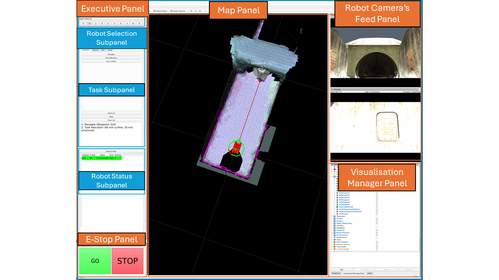

## Authors
[Yanran Jiang](#)¹, [Pavan Sikka](#)¹, [Leimin Tian](#)¹, [Dana Kulic´](#)¹², and [C´ecile Paris](#)¹  
¹ Data61, CSIRO, Australia
² Faculty of Engineering, Monash University, Australia

<video controls width="800">
  <source src="assets/Operator_Expertise_video.mp4" type="video/mp4">
  Your browser does not support the video tag.
</video>

## Abstract
As autonomous robots are increasingly deployed in complex and high-risk environments, they are supervised by users with diverse levels of robotics expertise. As the diversity of the user population increases, it is important to understand how users with different expertise levels approach the supervision task and how this impacts performance of the human-robot team. This exploratory study investigates how operators with varying expertise levels perceive information and make intervention decisions when supervising a remote robot. We conducted a user study (N=27) where participants supervised a robot autonomously exploring four unknown tunnel environments in a simulator, and provided waypoints to intervene when they believed the robot had encountered difficulties. By analyzing the interaction data and questionnaire responses, we identify differing patterns in intervention timing and decision-making strategies across novice, intermediate, and expert users. 

Fig. Operator Interface

---
### Recording of Scenario 1
<video controls width="800">
  <source src="assets/Recording of Scenario 1.mp4" type="video/mp4">
  Your browser does not support the video tag.
</video>

### Recording of Scenario 2
<video controls width="800">
  <source src="assets/Recording of Scenario 2.mp4" type="video/mp4">
  Your browser does not support the video tag.
</video>

### Recording of Scenario 3
<video controls width="800">
  <source src="assets/Recording of Scenario 3.mp4" type="video/mp4">
  Your browser does not support the video tag.
</video>

### Recording of Scenario 4
<video controls width="800">
  <source src="assets/Recording of Scenario 4.mp4" type="video/mp4">
  Your browser does not support the video tag.
</video>

## Acknowledgements
This project was funded by CSIRO’s CINTEL FSP program.

*This page was generated by GitHub Pages.*
